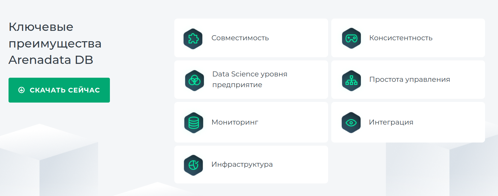

# СУБД и CAP-еорема
## DragonFLY - CA

> When compared to Redis and Memcached datastores, 
> Dragonfly delivers 25X more throughput, higher cache 
> hit rates, with **lower tail latency**, and effortless 
> vertical scalability.

*Источник:* [DragonFly Giter Club](https://giter.club/dragonflydb/dragonfly)

> Dragonfly is an open-source distributed data storage 
> system designed to provide a high-performance and 
> **highly available** in-memory storage option. It is 
> built to handle large amounts of data and handle high 
> read and write loads, with a **focus on low-latency data access**.

*Источник:* [Geek Culture](https://medium.com/geekculture/dragonfly-a-high-performance-in-memory-data-store-for-distributed-systems-248edc02b0c6)

DragonFly имеет низкую временную задержку и высокую доступность,
т.е. является CA системой.

---
## ScyllaDB - AP

> ScyllaDB is a **PA/EL highly available, partition tolerant**, 
> low latency database system. ScyllaDB was designed to 
> provide consistent low-latencies, not just be highly 
> available, and it also provides tunable consistency. 
> Under any conditions short of a complete system failure, 
> ScyllaDB will remain highly available with predictable low
> latencies for mission critical applications.

*Источник:* [scylladb.com](https://www.scylladb.com/glossary/cap-theorem/)

ScyllaDB использует модель настраиваемой согласованности для обеспечения
высокой доступности. Согласованность в данном смысле не является строгой
и в значительной степени зависит от доступности.

Любой узел может обслуживать любой запрос, нет единой точки 
координации, и все узлы в системе продолжают совместно 
предоставлять услуги, даже когда узлы становятся недоступными.

---
## ArenaData DB - CP

> Гибкая система резервирования позволяет установить и 
> настроить кластер с заранее заданным уровнем 
> отказоустойчивости, позволяя СУБД работать даже 
> при выходе из строя половины серверов из кластера.

*Источник:* [arenadata.tech](https://arenadata.tech/products/arenadata-db/)

ArenaData обладает согласованностью и отказоустойчивостью,
т.о. является CP системой.